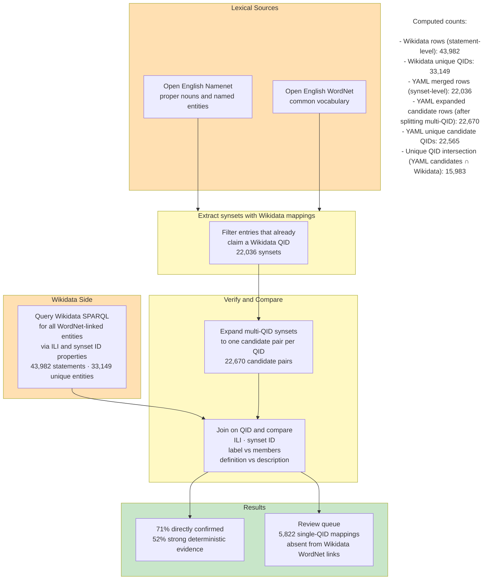
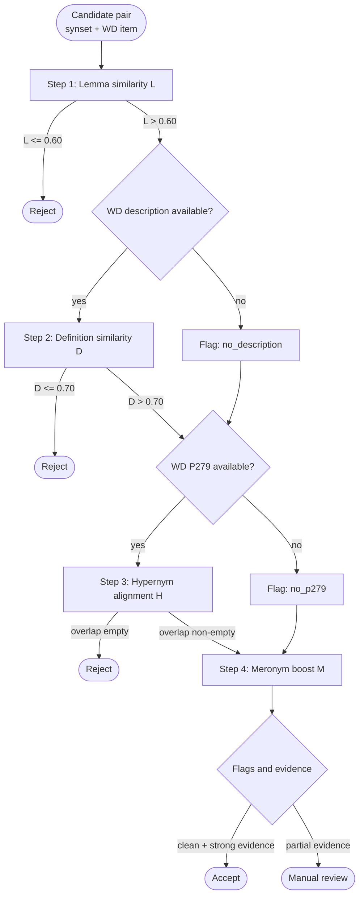

# Comparison Pipeline Plan

## Goal

Build an auditable synset-to-Wikidata comparison workflow using existing outputs, with clear auto-accept vs review decisions.

## Inputs

- `output/merged_mapped.csv` (synset-side source truth)
- `output/wikidata_wordnet_links.csv` (Wikidata-side links + label/description)

## 1) Keep Source-Truth Table Unchanged

Keep `merged_mapped.csv` as the canonical source table:

- `synset_id`
- `definition`
- `ili`
- `members`
- `wikidata_qid`
- `multi_qid`
- `qid_count`
- `review_status`
- `in_oewn`
- `in_oenn`

## 2) Build Candidate Comparison Table

Create a second table with one row per `(synset_id, qid_candidate)` pair.

Rationale:

- One synset can contain multiple candidate QIDs.
- Candidate-level rows are easier to score and review.

## 3) Clean Wikidata Rows Before Joining

From `wikidata_wordnet_links.csv`:

- Keep only rows where `qid` matches `^Q[1-9][0-9]*$`
- Keep only rows with at least one of `ili` or `ssid`
- Remove exact duplicate rows

## 4) Expand YAML QIDs to Candidate Rows

From `merged_mapped.csv`:

- If `multi_qid=FALSE`: produce one candidate row
- If `multi_qid=TRUE`: split `wikidata_qid` by `|` and produce one row per candidate
- Preserve original source flags and review metadata

Recommended preserved fields:

- `synset_id`
- `definition`
- `ili`
- `members`
- `qid_candidate`
- `qid_count_original`
- `multi_qid_original`
- `in_oewn`
- `in_oenn`

## 5) Attach Wikidata Text and IDs

Join candidate rows on `qid_candidate = qid` to add:

- `entity_label`
- `entity_description`
- `wd_ili`
- `wd_ssid`

## 6) Compute Deterministic Match Signals

For each candidate row:

- `match_ssid_exact`: `synset_id == wd_ssid`
- `match_ili_exact`: `ili == wd_ili`
- `match_label_in_members_exact`: `entity_label` equals one member token
- `match_label_in_members_norm`: normalized label/member token match (lowercase + punctuation/hyphen normalization)
- `definition_overlap_score`: token overlap between synset definition and Wikidata description

## 7) Decision Rules

Assign one of: `AUTO_ACCEPT`, `REVIEW_REQUIRED`, `REJECT`.

Suggested baseline rules:

- `AUTO_ACCEPT` if `qid_count_original=1` and:
  - `match_ssid_exact=1`, or
  - `match_ili_exact=1` and (`match_label_in_members_exact=1` or `match_label_in_members_norm=1`)
- `REVIEW_REQUIRED` if `qid_count_original>1`
- `REVIEW_REQUIRED` if structural evidence conflicts (e.g., ssid/ili mismatch)
- `REVIEW_REQUIRED` if only text evidence is moderate
- `REJECT` if no structural match and weak text evidence

## 8) Record Decision Reason Codes

Write machine-readable reason codes, e.g.:

- `MULTI_QID_IN_YAML`
- `SSID_EXACT_MATCH`
- `ILI_EXACT_LABEL_MATCH`
- `STRUCTURE_CONFLICT`
- `TEXT_ONLY_WEAK`
- `NO_EVIDENCE`

## 9) Outputs

Produce:

- `output/comparison_all_candidates.csv`
- `output/comparison_auto_accept.csv`
- `output/comparison_review_queue.csv`

## Notes

- Keep all multi-QID rows in review; do not auto-pick first candidate.
- Keep candidate-level evidence transparent for manual adjudication.
- Maintain source lineage (`in_oewn`, `in_oenn`) in all downstream outputs.

## Current Results Snapshot

Generated from [output/comparison_table.csv](output/comparison_table.csv).

### Core Totals

- Total rows: 22,670
- QID join found: 16,085 (70.95%)
- QID join missing: 6,585 (29.05%)

### Deterministic Match Signals

- SSID exact match: 1,958 (8.64%)
- ILI exact match: 12,849 (56.68%)
- Label in members (exact): 13,614 (60.05%)
- Label in members (normalized): 14,238 (62.81%)
- Definition-description overlap (any): 13,514 (59.61%)

### Multi-QID and Review Pressure

- Multi-QID rows: 1,252 (5.52%)
- Multi-QID with join missing: 763 (3.37%)
- Strong evidence rows (join + ILI exact + normalized label/member): 11,758 (51.87%)
- Single-QID but join missing rows: 5,822 (25.68%)

### Source Breakdown

- OEWN: 9,913 rows; join found 63.43%; join missing 36.57%; multi-QID 11.5%; strong evidence 41.19%
- OENN: 12,757 rows; join found 76.8%; join missing 23.2%; multi-QID 0.88%; strong evidence 60.16%

### Overlap Buckets (definition vs description)

- 0: 9,156
- 1-2: 6,133
- 3-5: 6,145
- 6-10: 1,202
- 11+: 34

### Supporting Output Files

- Summary JSON: [output/comparison_stats_summary.json](output/comparison_stats_summary.json)
- Stats by source: [output/comparison_stats_by_source.csv](output/comparison_stats_by_source.csv)
- Top flag combinations: [output/comparison_stats_flag_combos.csv](output/comparison_stats_flag_combos.csv)
- Single-QID join-missing queue: [output/comparison_queue_single_qid_no_join.csv](output/comparison_queue_single_qid_no_join.csv)

## Row Count Interpretation (Why 22k vs 44k)

This project currently builds the comparison table from the YAML side first, then enriches with Wikidata by QID.

Computed counts:

- Wikidata rows (statement-level): 43,982
- Wikidata unique QIDs: 33,149
- YAML merged rows (synset-level): 22,036
- YAML expanded candidate rows (after splitting multi-QID): 22,670
- YAML unique candidate QIDs: 22,565
- Unique QID intersection (YAML candidates ∩ Wikidata): 15,983

Interpretation:

- `wikidata_wordnet_links.csv` is statement-level, so one QID can appear in multiple rows.
- `comparison_table.csv` is candidate-level and uses YAML-expanded rows as the base (left-side shape).
- Therefore comparison rows stay around 22.7k, not 44k.
- Wikidata multiplicity still matters for evidence quality, but it does not set the row count in the current join strategy.

## Presentation Pack (2 Slides, 4 Minutes)

### Slide 1 Diagram: Current Workflow and Status

### Slide 2 Diagram: Planned Weighted Mapping Pipeline

Planned score for survivors of steps 1 to 3:

$$
S = 0.30L + 0.45D + 0.15H + 0.10M
$$

Where:

- `L`: lemma similarity
- `D`: definition/description similarity
- `H`: hypernym/class alignment
- `M`: meronym/has-part alignment

### 4-Minute Speaker Script

#### Slide 1 (about 2 minutes)

This project validates mappings between WordNet synsets and Wikidata entities using a transparent, stepwise pipeline.

We start from two lexical sources: Open English WordNet and Open English Namenet. We extract only entries that already claim a Wikidata mapping. That gives us 22,036 synset rows.

In parallel, we fetch Wikidata records linked to WordNet through properties P5063 and P8814. This gives 43,982 statement-level rows. The row count is higher because Wikidata can contain multiple statements per QID.

We then build a candidate-level comparison table. Multi-QID synsets are expanded into one row per candidate, resulting in 22,670 rows for analysis.

Current verification results are strong: 70.95% of rows find a direct QID join, and 51.87% show strong deterministic evidence from combined signals. At the same time, we surface real data-quality issues: 5,822 rows are single-QID mappings that do not appear in current Wikidata WordNet-link statements.

So the pipeline is doing exactly what we need: it confirms good mappings and isolates likely stale or missing links for review.

#### Slide 2 (about 2 minutes)

Next, after finishing deterministic verification, we move to a weighted semantic mapping stage.

The process starts with lemma similarity as a fast gate. If it passes, we add definition-to-description similarity. Then we add structural evidence from taxonomy alignment using hypernyms and class links. Finally, meronym alignment is used as a confidence boost, not a hard reject criterion.

For candidates that survive early gates, we compute a weighted score:

S equals 0.30 times lemma similarity, plus 0.45 times definition similarity, plus 0.15 times hypernym alignment, plus 0.10 times meronym alignment.

This keeps lexical and semantic content as primary evidence, while still using graph structure where available.

The expected output is three-way triage: clear accepts, clear rejects, and a focused manual-review queue for ambiguous or conflicting cases, especially multi-QID rows.

This gives us both high precision and an auditable review process.

### Optional Short Closing Line

We now have a reproducible verification baseline, quantified discrepancy queues, and a clear path to move from deterministic checks into weighted semantic reconciliation.

## Real-World Use Cases for WordNet + Wikidata Mappings

### 1. Concept-Based Search Engine

Users can search for ambiguous terms like "jaguar" and immediately see the different meanings, such as animal, car brand, or software name. Each meaning is connected to WordNet semantic relations and Wikidata factual information, making search results more precise and informative.

### 2. Educational Concept Mapper

Students can input any topic and receive an interactive visual map showing how it relates to other concepts. WordNet provides the semantic structure, including hypernyms and meronyms, while Wikidata adds real-world examples, images, and facts. This makes complex subjects easier to understand.

### 3. Smart Content Creation Assistant

Writers and content creators can get automatic suggestions for semantically related terms and relevant facts while writing. WordNet ensures the suggestions are contextually appropriate, and Wikidata provides accurate, up-to-date information to enrich the content.

### 4. Cross-Language Terminology Helper

Users working across languages can look up a term and get the right sense, related concepts, and corresponding Wikidata entities. This helps with translation, localisation, and terminology alignment when the same concept needs to be handled consistently across languages.

### 5. Ontology Curation Assistant

An ontology editor checks whether a class label, definition, and external entity mapping are consistent, using WordNet for semantic placement and Wikidata for factual grounding. This helps spot modelling errors early.

#### Example: Protégé Class Review

In Protégé, an editor creates a class:

- **Class**: EiffelTower
- **SubClassOf**: RadioTower
- **Definition**: "A radio broadcasting tower"

The plugin analyzes this and displays warnings:

1. **Hierarchy mismatch**: WordNet classifies "tower" under structure, not communication infrastructure. Wikidata lists Eiffel Tower as instance of tower, tourist attraction, and landmark. Suggestion: Move EiffelTower under TouristAttraction or Landmark.
2. **Definition incompleteness**: Wikidata indicates the tower's primary current function is tourism, with historical radio use. Suggestion: Update definition to "A wrought-iron lattice tower on the Champ de Mars in Paris, originally built for radio broadcasting, now primarily a tourist attraction."
3. **Missing properties**: Wikidata provides architect (Gustave Eiffel), completion date (1889), height (330m). Suggestion: Add these as data properties to the class.

The plugin presents these as inline warnings with one-click actions to implement the suggested changes.

#### Example: Eiffel Tower Writing Assistant

A writer opens Word and begins typing: "The Eiffel Tower is a famous landmark."

As they type "Eiffel Tower," the plugin detects the term, maps it to a WordNet synset and a Wikidata entity, then displays a sidebar with:

- Semantic alternatives: monument, tourist attraction, iron lattice tower
- Hypernyms: structure, building, landmark
- Meronyms: base, first floor, second floor, top, antenna
- Wikidata facts: height (330m), location (Paris, France), completion date (1889), architect (Gustave Eiffel)
- Related entities: Paris, France, Champ de Mars, Gustave Eiffel

The writer clicks "Gustave Eiffel" from the sidebar, and the plugin inserts: "The Eiffel Tower, designed by Gustave Eiffel, is a famous landmark."

The plugin then detects "Gustave Eiffel" and offers additional context: French engineer, birth/death dates, other works (including the Statue of Liberty's internal framework), allowing the writer to seamlessly expand the content with accurate, semantically relevant information.
